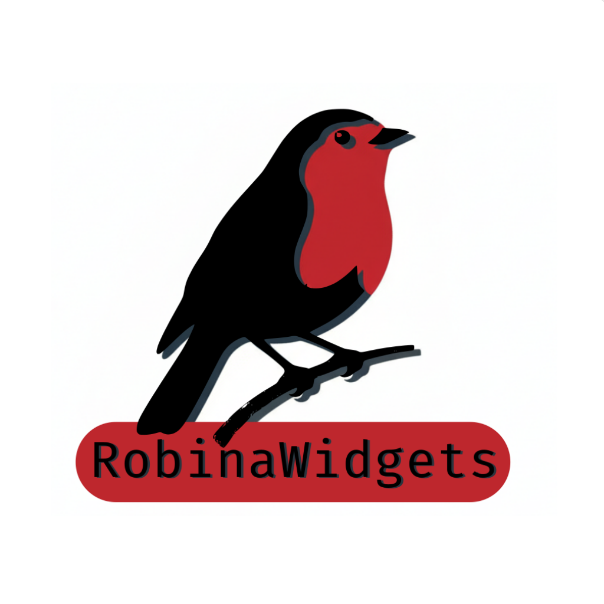
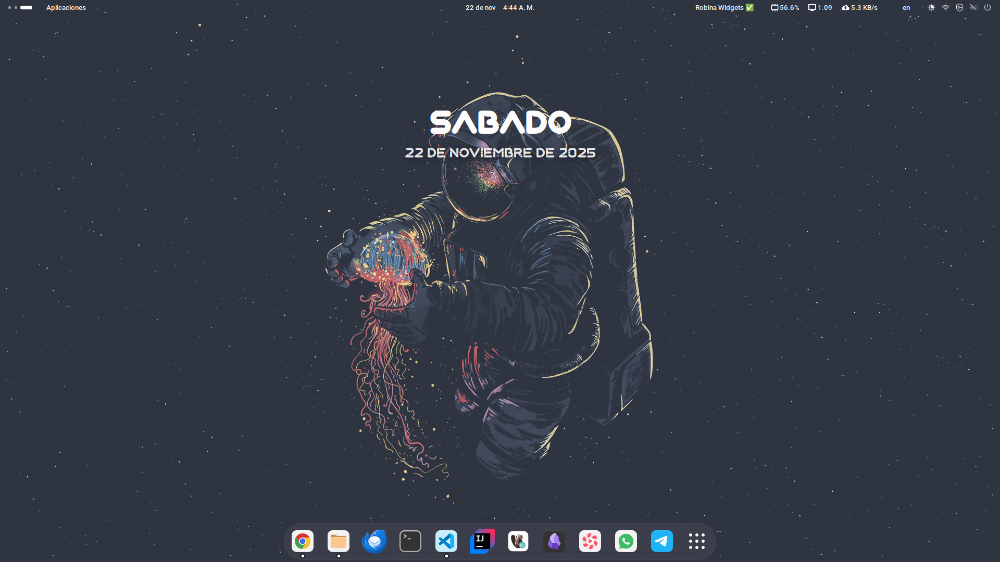

<table align="center">
  <tr>
    <td>
      
    </td>
    <td>
      <h1 style="margin-left: 10px;">Robina Widgets</h1>
    </td>
  </tr>
</table>

<p align="center">
  
</p>


Una extensión moderna para GNOME Shell que muestra información de fecha y hora de forma elegante en el fondo de pantalla.

## Descripción

Robina Widgets es una extensión para GNOME Shell que añade un widget visual en el centro superior de la pantalla mostrando el día de la semana y la fecha actual en español. El widget utiliza un diseño moderno con efectos de vidrio (glassmorphism), sombras suaves y animaciones sutiles.

### Características

- Widget centrado en la pantalla mostrando día y fecha en español
- Diseño moderno con efecto de vidrio y sombras suaves
- Actualización automática cada minuto
- Escalado automático según resolución de pantalla
- Reposicionamiento dinámico al cambiar monitores
- Indicador en el panel superior de GNOME
- Soporte para la fuente Nixmat instalada en el sistema
- Estilo personalizable mediante CSS

## Requisitos

- GNOME Shell 46 o superior
- Sistema operativo Linux con GNOME Desktop Environment
- Fuente Nixmat instalada en el sistema (opcional, usará sans-serif como fallback)

## Instalación

### Método 1: Instalación manual (usuario)

1. Clonar el repositorio o descargar los archivos:

```bash
git clone https://github.com/ixgramdev/Robina-Widgets-Gnome-Extension.git
cd Robina-Widgets-Gnome-Extension
```

2. Copiar la extensión al directorio de extensiones del usuario:

```bash
mkdir -p ~/.local/share/gnome-shell/extensions/robina@widgets.com
cp -r * ~/.local/share/gnome-shell/extensions/robina@widgets.com/
```

3. Recargar GNOME Shell:
   - En Xorg: Presiona `Alt+F2`, escribe `r` y presiona Enter
   - En Wayland: Cierra sesión y vuelve a iniciar sesión

4. Habilitar la extensión:

```bash
gnome-extensions enable robina@widgets.com
```

O usa la aplicación "Extensiones" desde el menú de aplicaciones.

### Método 2: Instalación a nivel de sistema

Para instalar la extensión para todos los usuarios:

```bash
sudo cp -r * /usr/share/gnome-shell/extensions/robina@widgets.com/
```

Luego sigue los pasos 3 y 4 del método anterior.

### Instalar la fuente Nixmat (opcional)

Si deseas usar la fuente Nixmat incluida:

```bash
sudo cp fonts/Nixmat.otf /usr/share/fonts/
fc-cache -f -v
```

## Uso

Una vez instalada y habilitada, la extensión mostrará automáticamente:

- Un indicador "Robina Widgets" en el panel superior
- Un widget en el centro superior de la pantalla con el día de la semana en mayúsculas
- La fecha completa en formato: "DD de mes de AAAA"

El widget se actualiza automáticamente cada minuto y se reposiciona correctamente al cambiar la configuración de monitores.

## Estructura del proyecto

```
robina@widgets.com/
├── extension.js           # Código principal de la extensión
├── metadata.json          # Metadatos y configuración
├── stylesheet.css         # Estilos CSS personalizados
├── COPYING               # Licencia GPL-3.0
├── fonts/
│   └── Nixmat.otf        # Fuente personalizada
├── schemas/
│   ├── gschemas.compiled
│   └── org.gnome.shell.extensions.system-monitor.gschema.xml
└── locale/               # Traducciones (heredadas)
    ├── es/
    ├── en/
    └── ...
```

## Personalización

### Modificar estilos

Puedes personalizar la apariencia editando el archivo `stylesheet.css`:

```css
/* Cambiar colores del texto */
.robina-day-label {
  color: #ffffff;
}

/* Ajustar el fondo del widget */
.day-widget {
  background: linear-gradient(135deg, rgba(255,255,255,0.06), rgba(255,255,255,0.03));
}
```

Después de hacer cambios, recarga la extensión:

```bash
gnome-extensions disable robina@widgets.com
gnome-extensions enable robina@widgets.com
```

### Cambiar idioma

Los nombres de días y meses están definidos en español dentro de `extension.js`. Para cambiar el idioma, edita las arrays `dayNames` y `monthNames` en el método `_updateDateTime()`.

## Desinstalación

Para desinstalar la extensión:

```bash
gnome-extensions disable robina@widgets.com
rm -rf ~/.local/share/gnome-shell/extensions/robina@widgets.com
```

Si la instalaste a nivel de sistema:

```bash
sudo rm -rf /usr/share/gnome-shell/extensions/robina@widgets.com
```

Luego recarga GNOME Shell.

## Solución de problemas

### La extensión no aparece en la lista

Verifica que los archivos estén en la ubicación correcta y que el UUID en `metadata.json` coincida con el nombre del directorio.

### El texto no se muestra correctamente

Asegúrate de que la fuente Nixmat esté instalada en el sistema o que tu sistema tenga una fuente sans-serif disponible.

### Ver logs de la extensión

Para depurar problemas:

```bash
journalctl -f /usr/bin/gnome-shell | grep robina
```

O ver todos los logs de GNOME Shell:

```bash
journalctl -f /usr/bin/gnome-shell
```

### La extensión no carga después de actualizar GNOME

Verifica que tu versión de GNOME Shell sea compatible (versión 46). Actualiza el campo `shell-version` en `metadata.json` si es necesario.

## Desarrollo

### Requisitos de desarrollo

- Node.js y npm (para herramientas de desarrollo opcionales)
- Conocimientos de JavaScript ES6+
- Familiaridad con GJS (GNOME JavaScript)
- Conocimientos de St (Shell Toolkit) y Clutter

### Ejecutar en modo desarrollo

1. Edita los archivos en tu directorio de extensiones
2. Recarga GNOME Shell para ver los cambios
3. Revisa los logs para detectar errores

### Contribuir

Las contribuciones son bienvenidas. Por favor:

1. Haz fork del repositorio
2. Crea una rama para tu feature (`git checkout -b feature/nueva-funcionalidad`)
3. Haz commit de tus cambios (`git commit -am 'Añade nueva funcionalidad'`)
4. Push a la rama (`git push origin feature/nueva-funcionalidad`)
5. Abre un Pull Request

## Licencia

Este proyecto está licenciado bajo la GNU General Public License v3.0 - ver el archivo [COPYING](COPYING) para más detalles.

## Créditos

- Desarrollado por ixgramdev
- Basado en el sistema de extensiones de GNOME Shell
- Fuente Nixmat incluida en el proyecto

## Recursos adicionales

- [Documentación de GNOME Shell Extensions](https://gjs.guide/extensions/)
- [GJS Documentation](https://gjs-docs.gnome.org/)
- [GNOME Shell Extension Review Guidelines](https://gjs.guide/extensions/review-guidelines/review-guidelines.html)

## Changelog

### Versión 1.0.0
- Primera versión pública
- Widget de fecha y hora centrado
- Diseño moderno con glassmorphism
- Soporte para fuente Nixmat
- Escalado automático según resolución
- Actualización automática cada minuto
